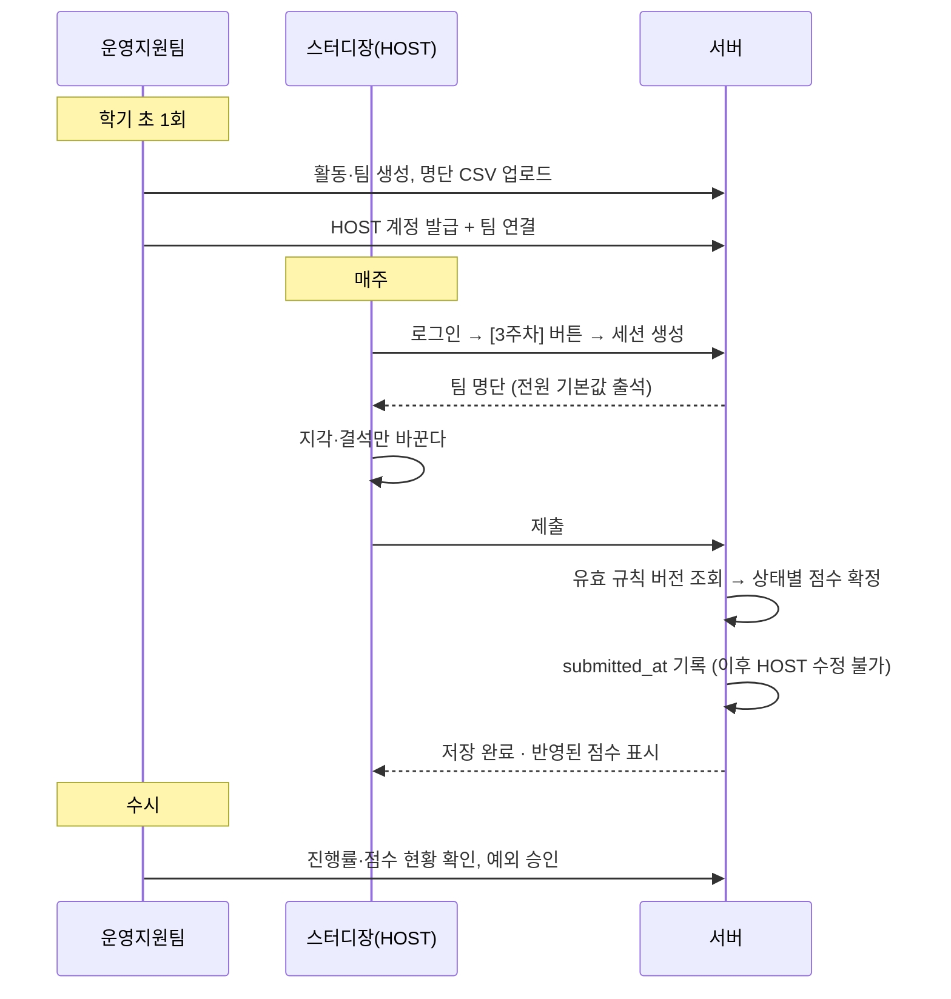

# 서류 평가 대시보드

## 1. 범위

| 영역 | 내용 | 백엔드 | 프론트 |
| --- | --- | --- | --- |
| 1. 출결 관리 | 스터디장 일괄 입력 → 점수 자동 집계 | **신규 전체** | 신규 |
| 2. 활동 점수 관리 | 엑셀 수동 집계 → 플랫폼 자동화 | **신규 전체** | 신규 |
| 3. 서비스운영팀 업무 | 아카이빙 CUD, CSV 추출, FAQ·후기·커리큘럼 | 기존 그대로 | 신규 |
| 4. 서류 평가 | 평가 대시보드, 개인 평가, 최종 합불 | 기존 그대로 | 신규 |
| 5. 규칙 추가 생성 탭 | 대표진 권한 | **신규** | 신규 |

### 이 시스템이 해결하는 문제

기존 방식의 병목은 **입력이 운영지원팀 한 곳에 몰린다는 것**이었다. 카페 글을 팀마다 돌아다니며 확인하고 엑셀에 옮겨 적는 일을 소수가 감당했다.

```
[기존]  10개 팀 카페 글  →  운영지원팀이 전부 확인  →  엑셀 수기 입력  →  수기 집계
[개선]  스터디장이 자기 팀만 입력  →  서버가 점수 자동 계산  →  운영지원팀은 결과만 확인
```

**입력을 스터디장 10명에게 분산하고, 집계를 자동화한다.** 스터디장은 자기 팀 8명만 체크하면 되고, 운영지원팀은 일일이 들어가지 않는다.

---

## 2. 권한 체계 (선행 개편)

### 2-1. 왜 바꾸는가

현재 role은 `SUPER` / `TEAM` 둘뿐인데, SUPER가 세 가지 의미를 겸하고 있다.

| 현재 SUPER의 의미 | 실제 주체 | 코드 |
| --- | --- | --- |
| 계정 CRUD·권한 부여 | 서비스운영팀장 | `AdminService:33, 45` |
| 최종 합불 결정 | 대표진 | `RecruitmentService:1180` |
| 전 부문 평가 | 차기대표진 | `RecruitmentService:1175` |

role만으로 구분이 안 되니 `teamName`을 보조 판정에 끌어 쓰는 구조가 됐고, `role == SUPER && teamName == 차기대표진` 같은 복합 조건이 서비스 곳곳에 흩어져 있다. 여기에 스터디장까지 들어오면 감당이 안 된다.

### 2-2. 두 개의 축

| 축 | 답하는 질문 | 값 |
| --- | --- | --- |
| **Role** | 무엇을 할 수 있나 | MASTER / SUPER / TEAM / HOST |
| **TeamName** | 어느 실무를 맡나 | 대표진, 차기대표진, 서비스운영팀, 운영지원팀, 스터디장 … |

| Role | 주체 | 성격 |
| --- | --- | --- |
| `MASTER` | 서비스운영팀장 | 계정 발급·시스템 관리 + 아카이빙·모집 CUD |
| `SUPER` | 대표진 3명 + 차기대표진 | **의사결정만.** 규칙 확정·최종 합불·출결 인정 |
| `TEAM` | 그 외 운영진 | 소속 팀 실무 + 서류 평가 |
| `HOST` | 스터디 | **출결 입력만.** Permission 없음 |

| 조직(team_name) | Role | TeamName |
| --- | --- | --- |
| 대표진 3명 | `SUPER` | 대표진 |
| 차기대표진 | `SUPER` | 차기대표진 |
| 서비스운영팀장 | `MASTER` | 서비스운영팀 |
| 서비스운영팀원 3 | `TEAM` | 서비스운영팀 |
| 운영지원팀 | `TEAM` | 운영지원팀 |
| 기획·대외협력·디자인·자료연구팀 | `TEAM` | 각 팀 |
| 스터디장 | `HOST` | 스터디장 |
| 일반 부원 | — | **계정 없음** |

### 2-3. Permission

서비스마다 `role`과 `teamName`을 직접 비교하면 지금과 같은 문제가 반복됨 → **이 계정이 이 권한을 갖는가**

```java
public enum Permission {
    ACCOUNT_MANAGE,        // 운영진 계정 생성·삭제·권한 부여
    CONTENT_MANAGE,        // 아카이빙·FAQ·후기·커리큘럼
    RECRUITMENT_MANAGE,    // 공고·질문·CSV
    ATTENDANCE_MANAGE,     // 활동·팀·명단·세션·HOST 계정
    ATTENDANCE_APPROVE,    // 출결 수동 수정·인정
    SCORE_MANAGE,          // 활동 점수 입력
    RULE_EDIT,             // 점수 규칙 DRAFT 작성·수정
    RULE_ACTIVATE,         // 점수 규칙 활성화(확정)
    EVALUATION,            // 서류 평가
    FINAL_DECISION         // 최종 합불
}
```

### 2-4. HOST - 발급부터 회수까지 운영지원팀이 맡는다

```
attendance_group.host_admin_id  →  A팀 담당 = 3번 계정
```

- **연결된 팀의 세션 생성과 출결 입력**
- 경로로도 막는다. HOST는 `/api/v1/admin/**`에 접근할 수 없고 `/api/v1/attendance/**`만 허용
- 계정은 기수마다 발급하고 회수한다. **누가 입력했는지 계정으로 남는다**

**스터디 운영을 운영지원팀이 하므로 계정도 같은 손에서 관리한다.**

| 단계 | 누가 | 무엇을 |
| --- | --- | --- |
| 1. 계정 생성 | **운영지원팀** | `POST /admin/attendance/hosts` — 아이디·초기 비밀번호 |
| 2. 스터디팀 연결 | **운영지원팀** | `PUT /admin/attendance/groups/{id}/host` |
| 3. 전달 | **운영지원팀** | 아이디·비밀번호를 스터디장에게 (**개별 계정** 발급할 것) |
| 4. 사용 | 스터디장 | 로그인 → 주차 선택 → 출결 입력 → 제출 |
| 5. 회수 | **운영지원팀** | 기수 말 soft delete + refresh token 정리 |

### 2-5. 권한 매트릭스

| 기능 | MASTER | SUPER | 서비스운영팀 | 운영지원팀 | 기타 운영진 | HOST (스터디장) |
| --- | --- | --- | --- | --- | --- | --- |
| 운영진 계정 생성·삭제·권한 부여 | O | X | X | X | X | X |
| 계정 목록 조회 | O | O | X | X | X | X |
| **HOST 계정 발급·팀 연결** | O | O | X | **O** | X | X |
| 점수 규칙 생성·활성화 | O | O | X | X | X | X |
| 점수 규칙 조회 | O | O | O | O | O | X |
| 활동·팀 생성·수정·삭제 | O | O | X | **O** | X | X |
| 명단 등록·수정·제외 | O | O | X | **O** | X | X |
| 세션 생성 | O | O | X | **O** | X | **O(담당 팀)** |
| **출결 입력·제출** | O | O | X | **O** | X | **O(담당 팀)** |
| 출결 현황 조회 | 전체 | 전체 | X | 전체 | 담당 팀 | 담당 팀 |
| **제출 후 출결 수정·인정** | O | O | X | **O** | X | X(요청만) |
| 활동 점수 입력 | O | O | X | **O** | X | X |
| 아카이빙·FAQ·후기 CUD | O | O | **O** | X | X | X |
| 모집 공고·질문·CSV | O | O | **O** | X | X | X |
| 서류 평가 | O(본인 track) | 전 부문(차기대표진) / 본인 track(대표진) | O(본인 track) | O(본인 track) | O(본인 track) | **X** |
| 최종 합불 | O | O | X | X | X | X |

## 3. 핵심 설계 결정

### 3-1. 입력은 스터디장이, 집계는 서버가 한다

**운영지원팀의 부담은 "확인"이 아니라 "입력"이다.** 즉**,** 10개 팀 카페 글을 일일이 열어보고 엑셀에 옮기는 일을 소수가 감당했다.

입력 주체를 스터디장으로 옮기면 한 사람이 8명만 체크하면 되고, 운영지원팀은 집계된 결과만 확인한다. **부담이 분산되고 총량도 줄어듦** 

|  | 기존 | 개선 |
| --- | --- | --- |
| 입력 주체 | 운영지원팀 소수 | 스터디장 10명 (각자 8명) |
| 입력 단위 | 카페 글 확인 후 엑셀 | 화면에서 체크 후 제출 |
| 집계 | 수기 | **자동** |
| 운영지원팀 | 전부 입력 | 결과 확인 + 예외 승인 |

### 3-3. 제출 전에는 자유롭게, 제출 후에는 요청으로

스터디장이 입력 주체지만, **제출한 뒤에는 스스로 고칠 수 없다.**

| 시점 | 스터디장 | 운영지원팀·대표진 |
| --- | --- | --- |
| 제출 전 | 자유롭게 수정 | — |
| **제출 후** | **수정 불가 (요청만)** | **수정 가능 (사유 필수)** |

---

### 4-2. 전체 흐름

